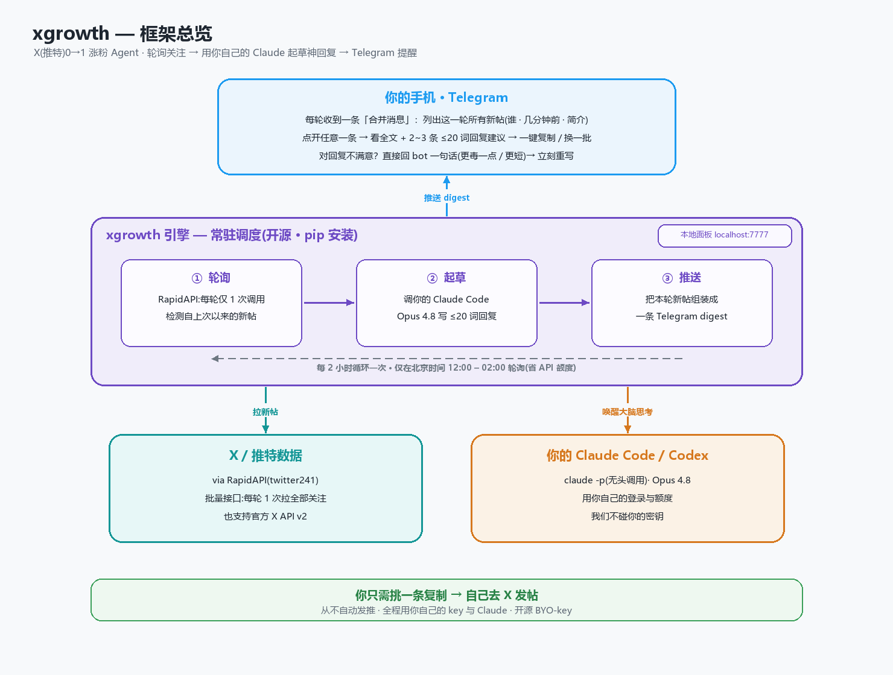

<div align="center">


# HypeX

**go from 0 → 1 on X: Be first to every post.**

一个开源的 X(推特)涨粉 Agent。给它一份关注名单,有人发新帖时,用**你自己本机的 Claude Code / Codex** 起草 2–3 条短小、有梗的回复,再推到你的 **Telegram** —— 你挑一条,自己去发。

[](LICENSE)
[](https://www.python.org)
[](https://telegram.org)
[](#需要你自己提供的东西)

[工作原理](#工作原理) · [安装](#安装) · [快速上手](#快速上手) · [命令](#命令) · [配置](#配置) · [Telegram](#telegram-配置60-秒) · [路线图](#路线图)

**[English](README_EN.md) | 简体中文**

</div>

> **开源 · 自带密钥(BYO-key)。** 大模型的"思考"跑在**你自己机器上**、用你已经在用的 coding agent。xgrowth 从不代理你的密钥,也从不替你自动发帖。

---

<div align="center">



</div>

## 工作原理

引擎是一个**一直醒着的调度器**;你的 Claude Code / Codex 是**大脑**——被叫醒、思考几秒、再睡回去。你**不用一直开着聊天窗口**。

**亮点**

- 🗂 **合并消息,不刷屏。** 每轮轮询只发**一条** Telegram 消息,列出这一轮所有新帖(带"几分钟前")。点进任意一条看全文 + 回复建议——像微信的合并转发卡片。
- 💬 **对话式改写。** 对任意一条回复直接回一句指令(`更毒一点`、`更短`、`换个梗`),大脑当场重写。
- ✂️ **默认极短。** 回复限制在 ~20 词以内(通常 10–15 词)—— 这才是 X 上真正能"接住"的长度。
- ⏰ **按时间窗轮询。** 只在每天的一个时间窗内轮询(默认北京时间 12:00–02:00,每 2 小时一次),不在凌晨白白烧 API 额度。
- 🐦 **每轮一次调用。** 用 RapidAPI provider 时,整份关注名单**一次 API 调用**就拉完(每个号的最新帖内联返回)。

## 需要你自己提供的东西

| 需要 | 在哪拿 |
| --- | --- |
| **推特数据** —— RapidAPI key(默认,便宜)*或* 官方 X API v2 bearer | [rapidapi.com](https://rapidapi.com)(如 *twitter241*)· [developer.x.com](https://developer.x.com) |
| 装好 **Claude Code** *或* **Codex** CLI | "大脑"(默认模型 Opus 4.8) |
| **Telegram bot token** | 找 [@BotFather](https://t.me/BotFather) 发 `/newbot` |
| Python 3.10+ | |

> **推特 provider。** 默认是 `rapidapi`——在 RapidAPI 上订阅一个 Twitter API,复制 `x-rapidapi-key`,整份名单每轮一次调用就拉完。想用官方 X API v2,把 `twitter.provider` 设成 `official` 即可。

## 安装

```bash
# 推荐:用 pipx 隔离安装这个 CLI 工具
pipx install git+https://github.com/cccyd2003-qwq/HypeX
# 或者用 pip:
git clone https://github.com/cccyd2003-qwq/HypeX && cd HypeX && pip install -e .
```

## 快速上手

```bash
xgrowth setup                      # 引导式向导:语言/key/大脑/Telegram/时间表 一条命令搞定
# (或手动:xgrowth init 后编辑 ~/.xgrowth/config.yaml)

xgrowth test-notify                # 验证 Telegram,自动抓取你的 chat_id
xgrowth add naval                  # 监控一个账号
xgrowth import-following 你的handle --min-followers 10000   # 或从你的关注里批量勾选
xgrowth doctor                     # 体检:配置/密钥/引擎/通知

xgrowth start                      # 启动 agent(轮询 + Telegram + 本地面板)
```

打开本地面板 **http://127.0.0.1:7777**,在浏览器里管理监控名单、回看最近的草稿。

### 现在就试一条草稿(不轮询)

```bash
xgrowth draft "the most important skill of the next decade is learning to learn" --from naval
```

## 命令

| 命令 | 作用 |
| --- | --- |
| `xgrowth setup` | 引导式向导:语言/key/大脑/Telegram/时间表 |
| `xgrowth lang en\|zh` | 查看/设置界面语言(Telegram + 命令提示) |
| `xgrowth init` | 创建配置 + 数据库 |
| `xgrowth schedule` | 查看/修改轮询时间表(间隔 + 每日时间窗) |
| `xgrowth add <handle>` | 把一个账号加入监控名单 |
| `xgrowth rm <handle>` | 移除一个账号 |
| `xgrowth list` | 查看监控名单 |
| `xgrowth import-following <handle>` | 拉取你的关注,挑一部分来监控 |
| `xgrowth once` | 跑一轮就退出(适合 cron) |
| `xgrowth start` | 启动完整 agent(轮询 + Telegram 监听 + 面板) |
| `xgrowth panel` | 只启动本地网页面板 |
| `xgrowth draft "<文本>"` | 给粘贴进来的推文起草回复 |
| `xgrowth test-notify` | 发一条测试通知 |
| `xgrowth doctor` | 检查配置/密钥/引擎/通知 |

## 配置

配置在 `~/.xgrowth/config.yaml`(可用 `XGROWTH_HOME` 改目录)。全部选项见 [`config.example.yaml`](config.example.yaml)。要点:

- `engine.provider` —— `claude` 或 `codex`;`engine.model` —— 默认 `claude-opus-4-8`
- `engine.styles` —— 轮换的回复风格(`神补刀`、`反直觉`…)
- `poll.interval_minutes` —— 默认 120;`poll.active_start_hour` / `active_end_hour` / `timezone_offset` —— 每天的轮询时间窗(默认北京 12:00–02:00)
- `notify.provider` —— `telegram`(完整:合并消息 + 钻入 + 对话改写),`lark` / `bark`(桩)

密钥也可以走环境变量:`XGROWTH_RAPIDAPI_KEY`、`XGROWTH_TELEGRAM_TOKEN`、`XGROWTH_TELEGRAM_CHAT`。

## Telegram 配置(60 秒)

1. 在 Telegram 里打开 **@BotFather**,发 `/newbot`,按提示走完,复制 **token**。
2. 填进 `notify.telegram.bot_token`。
3. 给你新建的机器人随便发一句话。
4. 跑 `xgrowth test-notify` —— 它会自动找到并保存你的 `chat_id`。

**两种推送模式**(`notify.telegram.mode`):

- **`dm`(默认)** —— 每轮发**一条合并消息**到你和 bot 的私聊,列出所有新帖。
- **`forum`(推荐,需论坛群)** —— 把 bot 拉进一个开启「话题」的群、设为管理员并给「管理话题」权限。每轮在群里发**一条索引消息**,每条新帖一个按钮;**你点了哪条,才为它单独建一个话题(Topic)并起草回复**——没点的不建、不花钱。点按钮即跳进该帖的**专属窗口**,在里面直接打字(如 `更毒一点`/`更短`)就能让它**基于你的话**重写;话题里有 **🗑 删除话题** 按钮;**每天新一轮推送开始前,会自动清空前一天的所有话题**(`poll.daily_topic_reset`)。

两种模式都默认**每轮最多处理 8 条新帖**(`poll.max_per_cycle`),避免积压刷屏。

## Skills(给 Claude Code / Codex 用)

[`skills/`](skills/) 里有两个 skill,让 agent 在你的 coding agent 里能对话式操作:

- **reply-craft** —— 手动共创、打磨回复;扩充范例库。
- **watchlist** —— 导入关注名单,挑选监控对象。

回复的"语气"在 `xgrowth/prompts.py` 里统一定义,由 [`examples/replies.jsonl`](examples/replies.jsonl) 做 few-shot 种子——把你看到的神回复加进去,引擎会越来越对味。

## 排错

- **`claude exited 1: ... model may not exist or you may not have access`** —— 你 Claude Code 的默认模型在无头(`-p`)模式下不可用。在配置里指定一个可用的:`engine.model: claude-haiku-4-5` 或你有权限的 Sonnet/Opus id。
- **Windows 上输出乱码** —— 已自动处理;xgrowth 会强制 UTF-8 输出。
- **`import-following` 报 `/following` 错** —— 某些 API 档位限制该端点;改用 `xgrowth add` 手动加号。

## 路线图

- **MVP(本仓库):** CLI 引擎(claude + codex)· reply-craft & watchlist 两个 skill · Telegram 合并消息 + 钻入 + 对话改写 · 本地面板 · 时间窗轮询。
- **下一步:** 更丰富的面板、完整的飞书/Bark 通知、回复数据分析、云端部署指南。
- **闭源付费版(独立):** 托管 7×24 云端调度、网页看板、代管密钥。

## 设计说明

完整的产品思路、开源 vs 付费的划分、以及这套架构背后的取舍,见 [`docs/PRODUCT.md`](docs/PRODUCT.md)。

## License

MIT.
